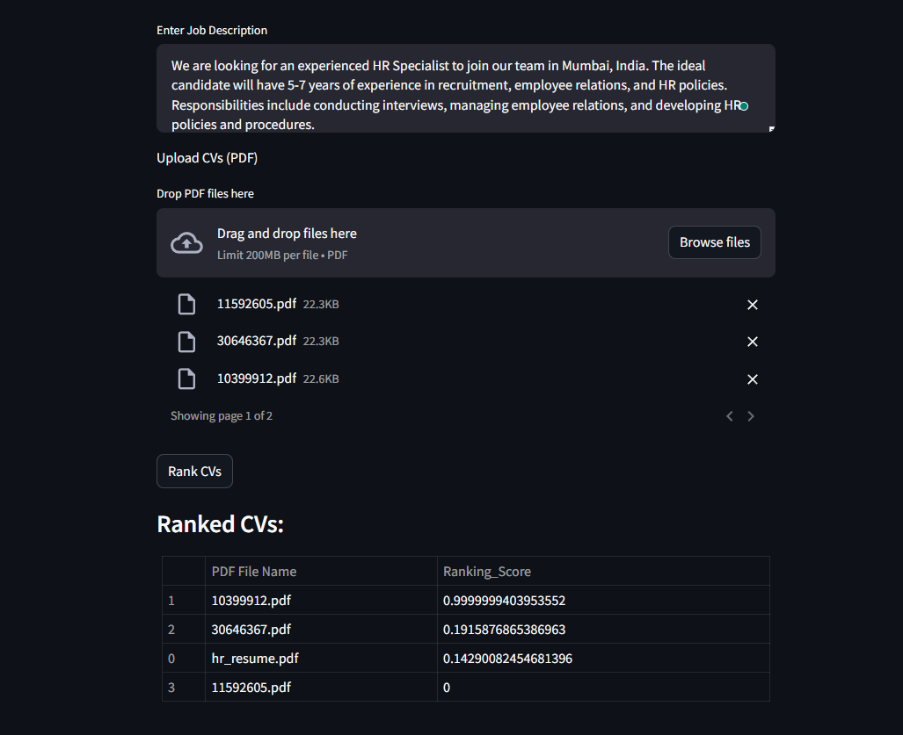

# RecruitFlow

RecruitFlow is a project designed to streamline the recruitment process for large companies by parsing through multiple CVs (resumes) and ranking them. The primary goal is to simplify and enhance the recruitment workflow, ensuring the identification and selection of top-notch candidates.

## Dataset

The dataset used for this project can be found on Kaggle at the following link: [Resume Dataset](https://www.kaggle.com/datasets/snehaanbhawal/resume-dataset?fbclid=IwAR30JL2LD72aie73rSbWcxZ1SZixwWnCOdawto4hkun5LIl9mXfeAW-EP0k)

## Project Overview

The project leverages machine learning techniques, particularly the Doc2Vec model and cosine similarity, to assess the similarity between job descriptions and CVs. This approach allows for the efficient ranking of CVs based on their relevance to specific job positions.

## Getting Started

### Installation

To install the required dependencies run:

```bash
pip install -r requirements.txt
```

To test the app run:

```bash
streamlit run app.py
```
## Screenshots

